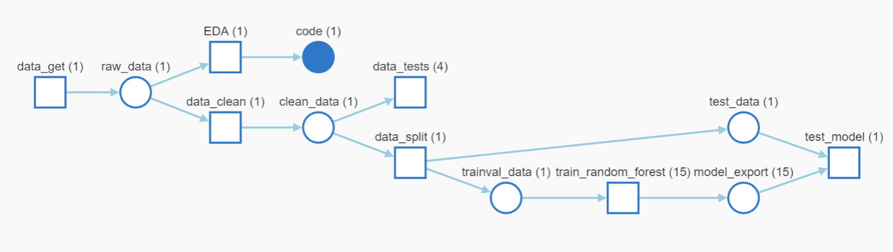

# Build a ML Pipeline for Short term Rental Prices in NYC


The second project for the [ML DevOps Engineer Nanodegree](https://www.udacity.com/course/machine-learning-dev-ops-engineer-nanodegree--nd0821) by Udacity.

Link to Github Project: https://github.com/sudarshanagh/build-ml-pipeline-for-short-term-rental-prices

Link to project in W&B: https://wandb.ai/sudarshanasharama/nyc_airbnb


## Description

This project is part of ```Unit 3: Building a Reproducible Model Workflow```. The problem is to build a complete end to end ML pipeline to predict rental prices for airbnb rentals and make it reusable.

## Prerequisites

Python and Jupyter Notebook are required.
Also a Linux environment may be needed within windows.


## Installation

Make sure to have conda installed and ready, then create a new environment using the environment.yml file provided in the root of the repository and activate it:

```bash
conda env create -f environment.yml
conda activate nyc_airbnb_dev
```

## Usage

Building a reproducible ML pipeline will require different components which will be needed to be contained in there own environment. The following image shows the pipeline contained within weights and biases. You can check the pipeline [here](https://wandb.ai/sudarshanasharama/nyc_airbnb/artifacts/model_export/random_forest_export/v296/lineage) at W&B 



The pipeline shows each component with input and output artifacts for each component.
- ```download```: Upload the data from local path to W&B
- ```eda```: A notebook which contains EDA for the dataset
- ```basic_cleaning```: Clean the dataset and handle outliers
- ```data_check```: Performs data validation
- ```data_split```: Splits the dataset to trainval and test
- ```train_random_forest```: Builds and trains a pipeline which includes handling of missing data, some feature engineering, modeling and generates scoring results.
- ```test_regression_model```: Evaluates the saved pipeline on the test data and generates scoring results.

 Build the pipeline.
```bash
cd ./Build-a-ML-Pipeline-for-Short-term-Rental-Prices-in-NYC
mlflow run . 
``` 

Run EDA step which will open a jupyter notebook
```bash
cd ./Build-a-ML-Pipeline-for-Short-term-Rental-Prices-in-NYC/src/eda
mlflow run . 
```

Run evaluation step
```bash
mlflow run . -P steps=test_regression_model
```

Run a specific component only
```bash
mlflow run . -P steps=train_random_forest
```

Run a sweep of different hyperparameters to train the model. ```hydra/launcher=joblib``` enables parallel training.
```bash
mlflow run . -P hydra_options="-m hydra/launcher=joblib modeling.random_forest.max_features=0.1,0.33,0.5,0.75,1 modeling.max_tfidf_features=10,15,30" steps=train_random_forest
```

Run the pipeline directly from github using a different sample of data.
```bash
mlflow run https://github.com/sudarshanagh/build-ml-pipeline-for-short-term-rental-prices.git \
            -v 1.0.3 \
            -P hydra_options="etl.sample='sample2.csv'"
```

## Extra Exploration


Based on the above observations of the Clean data, I decided to add the following steps to the preprocessor and check if there's any improvement to the [model](https://wandb.ai/sudarshanasharama/nyc_airbnb/artifacts/model_export/random_forest_export/preprod/overview) obtained by adhering to the instructions:
1. Try other regression models like Logistic Regression and Linear Regression. 
2. Reduce skewness of the ```minimum_nights``` column by applying logarithmic transformation to the values
3. Drop the columns with high zeroes: ```number_of_reviews``` and ```availability_365```

Below are my findings :
1. Logistic regression is not suitable for this dataset as MAE is very [high](https://wandb.ai/sudarshanasharama/nyc_airbnb/table?nw=z62bgkb57b) in spite of trying multiple permutations of the Hydra hyperparameters
2. Linear regression produces [better outcomes](https://wandb.ai/sudarshanasharama/nyc_airbnb/table?nw=z4ptblx99wm) , but MAE is still greater than the original value of 33.88
3. The Random Forest Regression model is slightly [improved](https://wandb.ai/sudarshanasharama/nyc_airbnb/runs/fura6yyp/overview?nw=nwusersudarshanasharma7) by the addition of log-transform to the preprocessor for skewed data
4. The  Random Forest Regression model is [not improved](https://wandb.ai/sudarshanasharama/nyc_airbnb/runs/v7mcw3ol/overview?nw=nwusersudarshanasharma7) on dropping the high-zero columns.
5. After multiple sweeps for the Hydra hyperparameters to ```max_depth```, ```max_features``` and ```n_estimators``` for the random-forest model and, ```max_tfidf_features``` for TfidfVectorizer, I arrived at the final [model](https://wandb.ai/sudarshanasharama/nyc_airbnb/artifacts/model_export/random_forest_export/v284)

## License

[License](LICENSE.txt)
